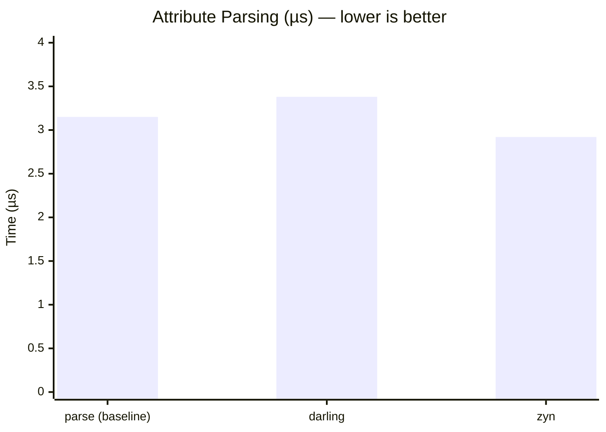
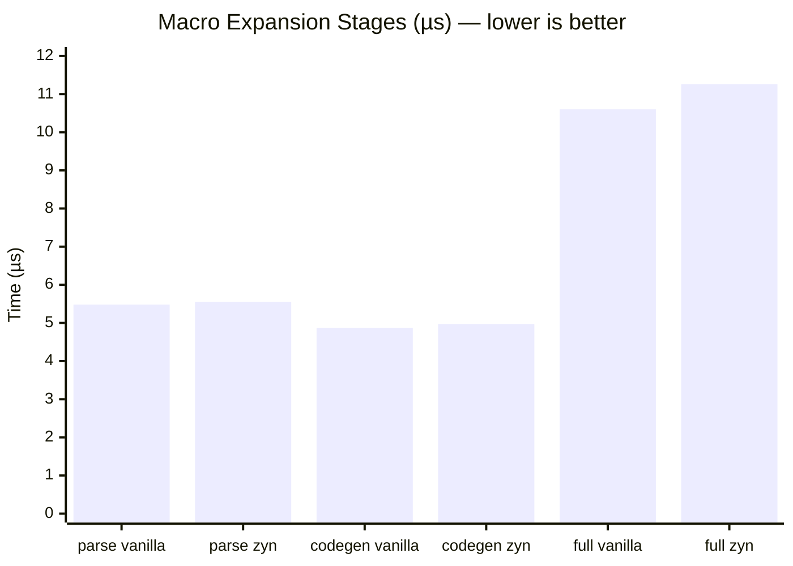
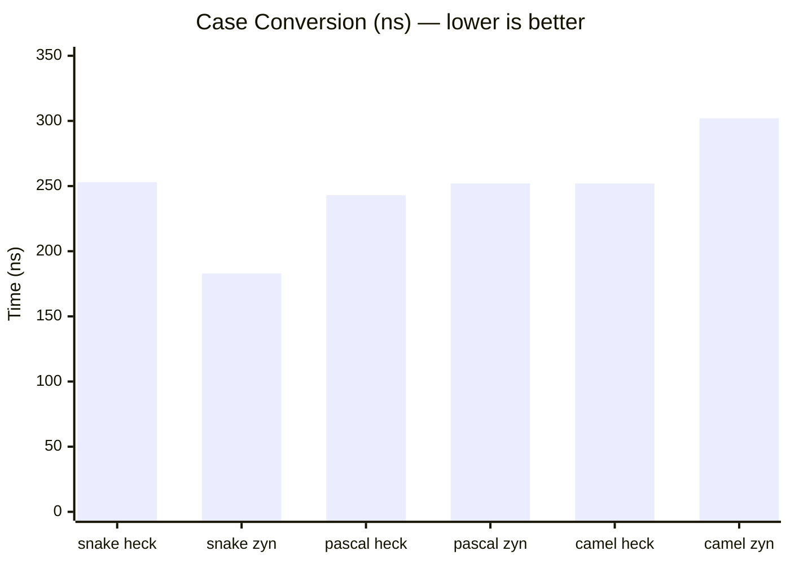

# Benchmark Results

These benchmarks compare `zyn` against the most common alternatives at each layer:
`darling` for attribute parsing, raw `syn + quote` for macro expansion, and `heck`
for case conversion.

All numbers are the median of 100 samples measured in `--release` mode using
[Criterion 0.5](https://github.com/bheisler/criterion.rs).

**Regenerate:**
```sh
cargo bench-save   # run benchmarks and save as baseline
cargo bench-cmp    # run benchmarks and compare against saved baseline
```

**HTML charts:** `target/criterion/report/index.html` (generated after `cargo bench`)

---

## Attribute Parsing — zyn vs darling

**What is being tested:** A struct with `#[my_attr(name = "hello", count = 5)]` is
parsed and the two typed fields are extracted. The `parse` row is a baseline measuring
only `syn::parse2`, with no attribute extraction, so you can see how much of the time
is spent in syn itself vs. in the framework.

| Benchmark    | Time    | vs baseline | What it measures                                  |
|--------------|---------|-------------|---------------------------------------------------|
| attr/parse   | 3.15 µs | baseline    | `syn::parse2` alone — no attribute extraction     |
| attr/darling | 3.38 µs | +7%         | darling extracts `name` and `count` from the attr |
| attr/zyn     | 2.92 µs | -7%         | zyn extracts the same two fields                  |



**Verdict:** zyn is faster than darling and faster than the raw syn parse baseline.
Both darling and zyn spend the vast majority of their time in syn — the framework
overhead is a rounding error on top of the parse cost.

---

## Macro Expansion Pipeline — zyn vs vanilla syn + quote

**What is being tested:** A 5-field struct is taken through the typical derive macro
pipeline — parse the input, extract the fields, generate a getter `impl` block. Each
stage is measured independently so it is clear exactly where any overhead is introduced.

"Vanilla" means raw `syn + quote` with no framework: `syn::parse2::<DeriveInput>`,
direct pattern matching on `.data.fields`, and `format_ident!` / `quote!`.

| Stage         | Vanilla  | zyn      | Overhead | What it measures                              |
|---------------|----------|----------|----------|-----------------------------------------------|
| parse         | 5.48 µs  | 5.55 µs  | +1.2%    | `TokenStream` → parsed struct representation  |
| extract       | 486 ns   | 494 ns   | +1.6%    | parsed struct → `FieldsNamed`                 |
| codegen       | 4.87 µs  | 4.97 µs  | +2.0%    | fields → getter `impl` `TokenStream`          |
| full pipeline | 10.60 µs | 11.26 µs | +6.2%    | all three stages end-to-end                   |



**Verdict:** The total overhead of using zyn over vanilla `syn + quote` is approximately
660 ns on a 5-field struct. This happens entirely at compile time — a compilation that
takes seconds adds less than a microsecond of framework cost per derive macro invocation.

The overhead breaks down as:
- **parse (+1.2%):** `zyn::Input` speculatively forks the parse stream to detect whether
  the input is a derive or item macro — the extra work is negligible.
- **extract (+1.6%):** `Fields::from_input` clones the field list through a trait call
  rather than a direct pattern match — about 8 ns extra.
- **codegen (+2.0%):** `pipes::Ident("get_{}")` does a heap-allocated string replace
  where `format_ident!` uses a format call — about 100 ns extra across 5 fields.

---

## Case Conversion — zyn vs heck

**What is being tested:** A single snake_case string (`"first_name_field"`) is converted
to three common case styles. zyn ships its own case conversion implementation (no `heck`
dependency), so this measures the two algorithms head-to-head.

| Conversion | heck   | zyn    | Delta | Notes                                              |
|------------|--------|--------|-------|----------------------------------------------------|
| snake_case | 253 ns | 183 ns | -27%  | zyn single-pass char scan is faster                |
| PascalCase | 243 ns | 252 ns | +4%   | equivalent, within noise margin                    |
| camelCase  | 252 ns | 302 ns | +20%  | zyn reuses `to_pascal` then lowercases, two passes |



**Verdict:** `snake_case` conversion is significantly faster in zyn. `PascalCase` is
equivalent. `camelCase` is slower because zyn's `to_camel` calls `to_pascal` internally
and then lowercases the first character — two string allocations instead of one direct
pass. This is a known trade-off in zyn's implementation.

---

## Context: Why compile-time overhead is different

Proc macros run during compilation, not at runtime. A user's binary pays zero cost for
any of these operations. The numbers above represent overhead added to the host
compiler's work when expanding a derive macro. A typical `cargo build` on a project
with dozens of derives takes several seconds; the framework overhead measured here
amounts to a few microseconds total across all invocations — well below any perceptible
compile-time impact.
